# CupSipSmart - Sơ đồ Quy trình và Lưu đồ Chi tiết

Tài liệu này mô tả chi tiết các quy trình xử lý và luồng hoạt động của hệ thống CupSipSmart từ Frontend đến Backend và Database.

---

## Mục lục
1. [Kiến trúc Tổng quan](#kiến-trúc-tổng-quan)
2. [Xác thực người dùng (Authentication)](#xác-thực-người-dùng)
3. [Mượn ly (Borrow Cup)](#mượn-ly)
4. [Trả ly (Return Cup)](#trả-ly)
5. [Quản lý Ví (Wallet Management)](#quản-lý-ví)
6. [Green Feed & Social](#green-feed--social)
7. [Admin Dashboard](#admin-dashboard)
8. [Gamification System](#gamification-system)

---

## Kiến trúc Tổng quan

```
┌─────────────────┐
│   Frontend      │
│  (Next.js App)  │
└────────┬────────┘
         │
         │ API Calls
         ▼
┌─────────────────┐
│   API Routes    │
│  (Next.js API)  │
└────────┬────────┘
         │
    ┌────┴────┐
    │         │
    ▼         ▼
┌─────────┐ ┌─────────┐
│ Supabase│ │ Firebase│
│(PostgreSQL)│(Firestore)│
└─────────┘ └─────────┘

- Supabase: Users, Eco Actions, Admins
- Firebase: Cups, Transactions, Stores
```

---

## Xác thực người dùng (Authentication)

### Luồng đăng ký (Sign Up)

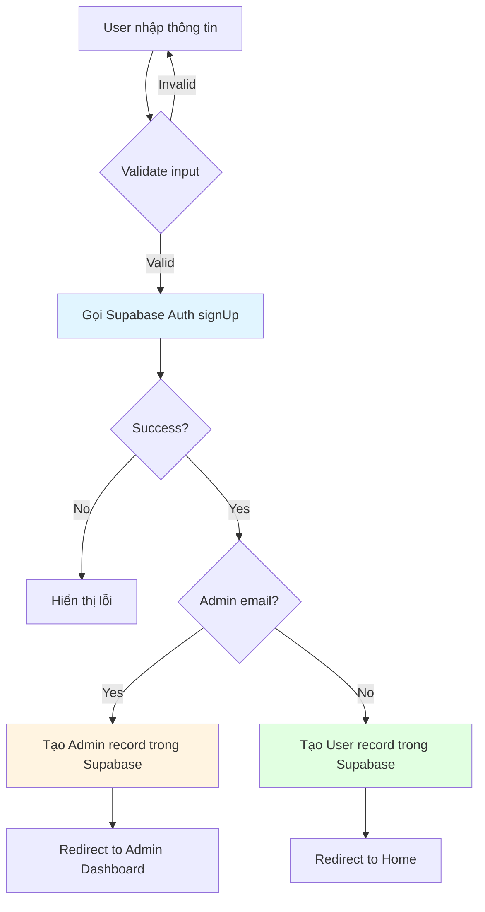

**Chi tiết Database Operations:**

1. **Supabase Auth:**
   - Tạo user trong `auth.users` (Supabase built-in)
   - Trả về `user.id` (UUID)

2. **Supabase Database:**
   - INSERT vào `users` table:
     ```sql
     INSERT INTO users (user_id, email, display_name, wallet_balance, green_points, rank_level)
     VALUES (userId, email, displayName, 0, 0, 'seed')
     ```

3. **Nếu là Admin:**
   - INSERT vào `admins` table:
     ```sql
     INSERT INTO admins (admin_id, email, display_name, role)
     VALUES (userId, email, displayName, 'super_admin')
     ```

### Luồng đăng nhập (Sign In)

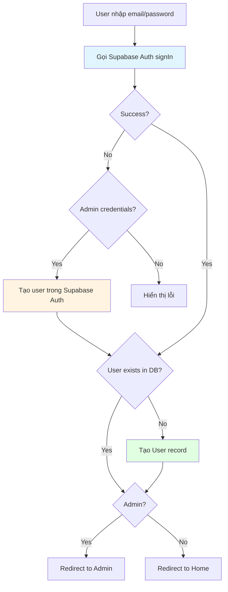

---

## Mượn ly (Borrow Cup)

### Luồng mượn ly chi tiết

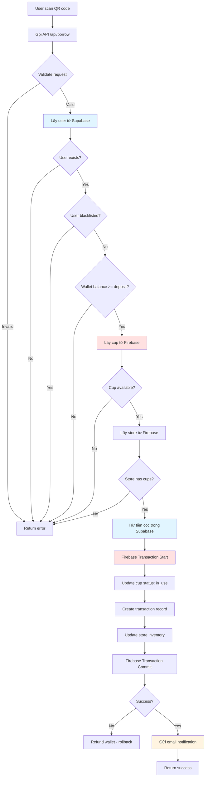

**Chi tiết Database Operations:**

1. **Supabase (Users):**
   ```sql
   -- Kiểm tra user
   SELECT * FROM users WHERE user_id = :userId;
   
   -- Trừ tiền cọc (trong API route)
   UPDATE users 
   SET wallet_balance = wallet_balance - :depositAmount
   WHERE user_id = :userId;
   ```

2. **Firebase (Atomic Transaction):**
   ```javascript
   runTransaction(async (tx) => {
     // Update cup
     tx.update(cupRef, {
       status: 'in_use',
       currentUserId: userId,
       currentTransactionId: transactionId
     });
     
     // Create transaction
     tx.set(transactionRef, {
       userId, cupId, borrowStoreId,
       borrowTime: now(),
       dueTime: now + 24h,
       status: 'ongoing',
       depositAmount: 20000
     });
     
     // Update store inventory
     tx.update(storeRef, {
       'cupInventory.available': increment(-1),
       'cupInventory.inUse': increment(1)
     });
   });
   ```

3. **Email Notification:**
   - Background job gửi email thông báo mượn ly thành công

---

## Trả ly (Return Cup)

### Luồng trả ly chi tiết

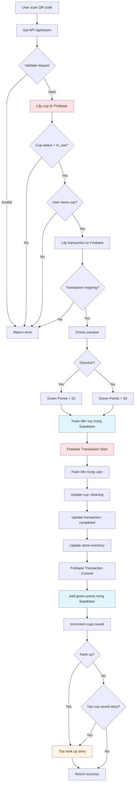

**Chi tiết Database Operations:**

1. **Supabase (Users):**
   ```sql
   -- Hoàn tiền cọc
   UPDATE users 
   SET wallet_balance = wallet_balance + :depositAmount
   WHERE user_id = :userId;
   
   -- Cộng green points và check rank up
   UPDATE users 
   SET green_points = green_points + :points,
       rank_level = CASE
         WHEN green_points + :points >= 5000 AND rank_level = 'seed' THEN 'sprout'
         WHEN green_points + :points >= 5000 AND rank_level = 'sprout' THEN 'sapling'
         -- ... more rank logic
         ELSE rank_level
       END
   WHERE user_id = :userId;
   
   -- Tăng số ly đã cứu
   UPDATE users 
   SET total_cups_saved = total_cups_saved + 1,
       total_plastic_reduced = total_plastic_reduced + 15
   WHERE user_id = :userId;
   
   -- Tạo eco action
   INSERT INTO eco_actions (user_id, type, cup_id, points, description)
   VALUES (:userId, 'return', :cupId, :points, 'Trả ly đúng hạn');
   ```

2. **Firebase (Atomic Transaction):**
   ```javascript
   runTransaction(async (tx) => {
     // Hoàn tiền (deprecated - now done in Supabase)
     
     // Update cup
     tx.update(cupRef, {
       status: 'cleaning',
       currentUserId: null,
       currentTransactionId: null
     });
     
     // Update transaction
     tx.update(transactionRef, {
       returnStoreId: storeId,
       returnTime: now(),
       status: 'completed',
       refundAmount: depositAmount,
       greenPointsEarned: greenPoints,
       isOverdue: isOverdue,
       overdueHours: overdueHours
     });
     
     // Update store inventory
     tx.update(storeRef, {
       'cupInventory.inUse': increment(-1),
       'cupInventory.cleaning': increment(1)
     });
   });
   ```

3. **Tạo Story (Firebase):**
   - Nếu rank up: Tạo achievement story với type 'rank_up'
   - Nếu trả đúng hạn: Tạo achievement story với type 'cup_saved'

---

## Quản lý Ví (Wallet Management)

### Luồng nạp tiền (Top-up)

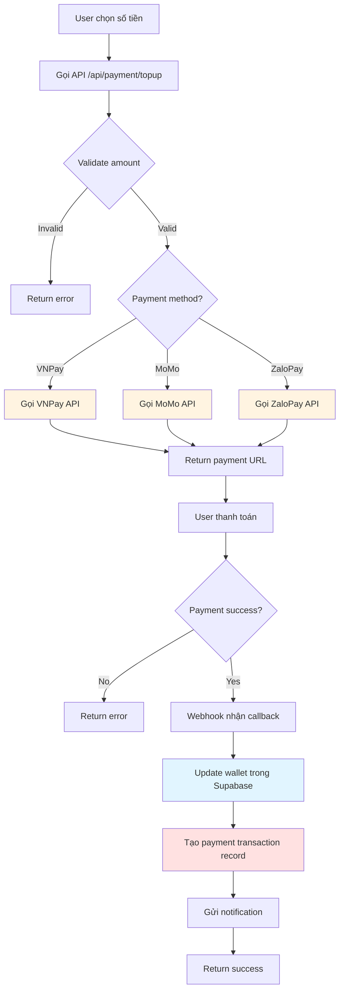

**Database Operations:**

```sql
-- Update wallet
UPDATE users 
SET wallet_balance = wallet_balance + :amount
WHERE user_id = :userId;

-- Tạo payment transaction (Firebase)
INSERT INTO payment_transactions (
  userId, type, amount, paymentMethod,
  status, transactionCode
) VALUES (
  :userId, 'topup', :amount, :method,
  'success', :code
);
```

### Luồng xem ví

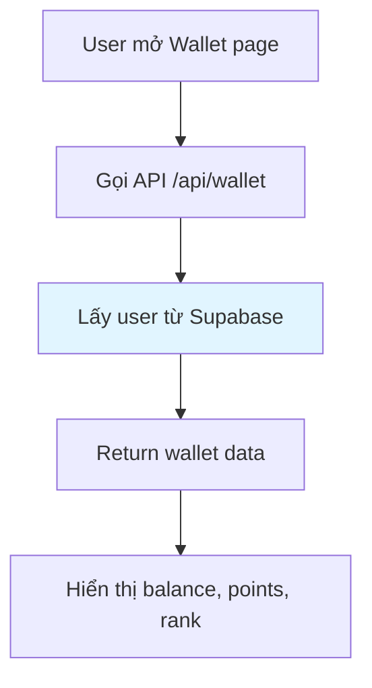

**Database Query:**

```sql
SELECT 
  wallet_balance,
  green_points,
  rank_level,
  total_cups_saved,
  total_plastic_reduced
FROM users
WHERE user_id = :userId;
```

---

## Green Feed & Social

### Luồng tạo post

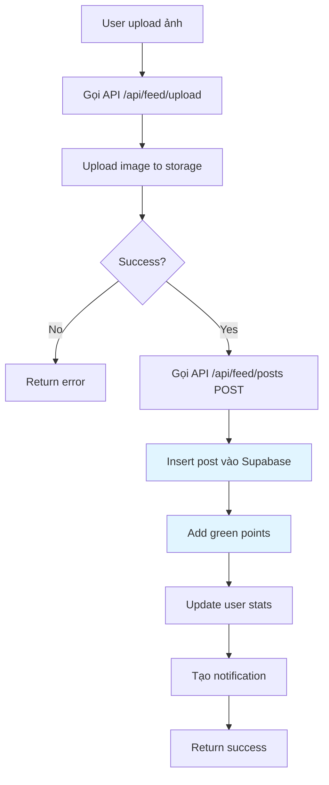

**Database Operations:**

```sql
-- Insert post
INSERT INTO green_feed_posts (
  user_id, display_name, avatar,
  image_url, caption, cup_id,
  green_points_earned
) VALUES (
  :userId, :displayName, :avatar,
  :imageUrl, :caption, :cupId,
  10
);

-- Add green points
UPDATE users 
SET green_points = green_points + 10
WHERE user_id = :userId;

-- Create notification
INSERT INTO notifications (
  user_id, type, title, message
) VALUES (
  :userId, 'success',
  'Bài đăng thành công!',
  'Bạn nhận được 10 Green Points!'
);
```

### Luồng like post

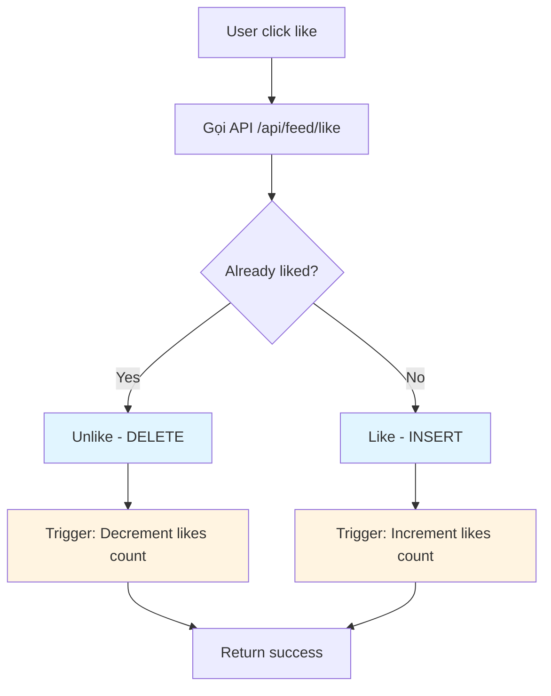

**Database Operations:**

```sql
-- Insert like (with UNIQUE constraint)
INSERT INTO post_likes (post_id, user_id)
VALUES (:postId, :userId)
ON CONFLICT (post_id, user_id) DO NOTHING;

-- Trigger automatically updates:
-- UPDATE green_feed_posts 
-- SET likes = likes + 1 
-- WHERE post_id = :postId;
```

---

## Admin Dashboard

### Luồng tạo QR code (Cup)

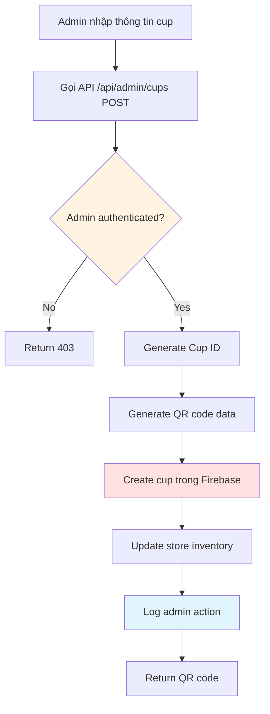

**Database Operations:**

```javascript
// Firebase
await adminDb.collection('cups').doc(cupId).set({
  cupId,
  material: 'pp_plastic',
  status: 'available',
  createdAt: admin.firestore.FieldValue.serverTimestamp(),
  totalUses: 0
});

// Update store
await adminDb.collection('stores').doc(storeId).update({
  'cupInventory.available': increment(1),
  'cupInventory.total': increment(1)
});

// Supabase - Log action
INSERT INTO admin_actions (admin_id, type, details)
VALUES (:adminId, 'create_qr', 'Created cup: ' || :cupId);
```

### Luồng xem analytics

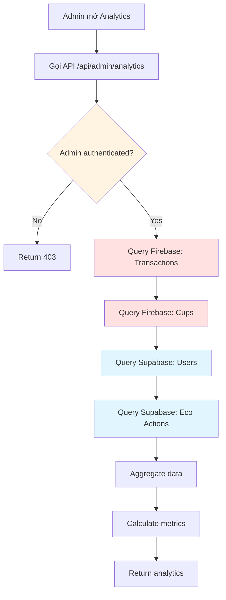

---

## Gamification System

### Luồng tính điểm và rank up

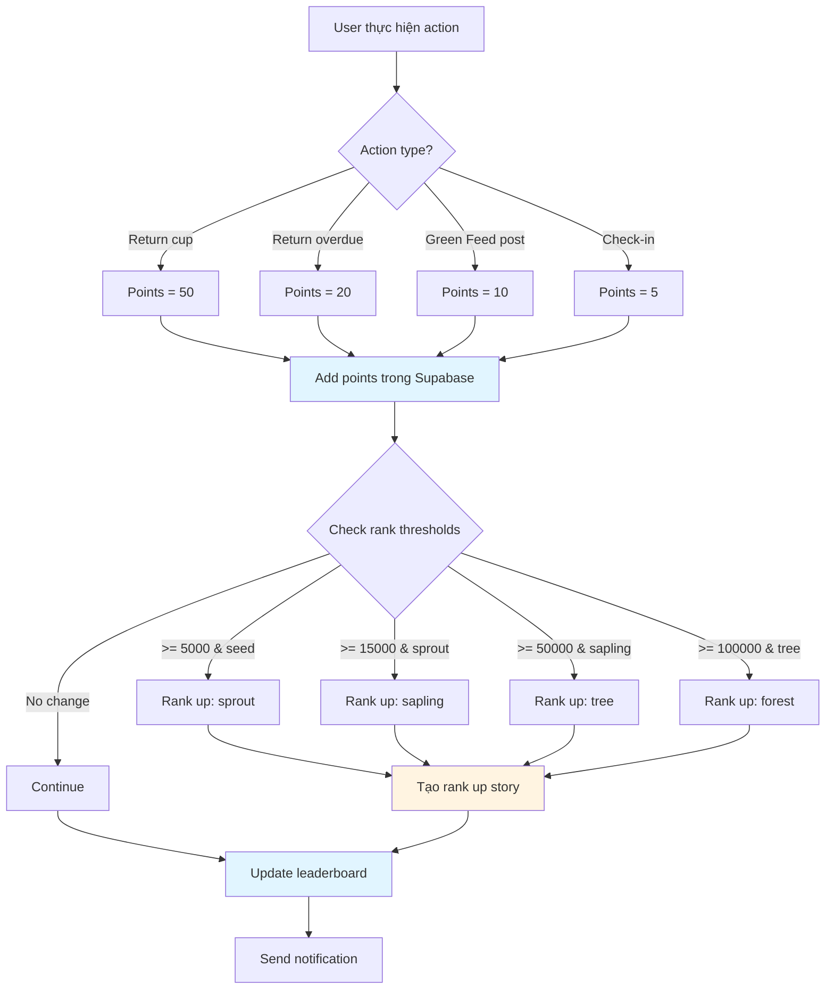

**Database Operations:**

```sql
-- Update user points and rank
UPDATE users 
SET 
  green_points = green_points + :points,
  rank_level = CASE
    WHEN green_points + :points >= 100 AND rank_level = 'seed' THEN 'sprout'
    WHEN green_points + :points >= 500 AND rank_level = 'sprout' THEN 'sapling'
    WHEN green_points + :points >= 2000 AND rank_level = 'sapling' THEN 'tree'
    WHEN green_points + :points >= 5000 AND rank_level = 'tree' THEN 'forest'
    ELSE rank_level
  END,
  last_activity = NOW()
WHERE user_id = :userId;

-- Create eco action
INSERT INTO eco_actions (user_id, type, points, description)
VALUES (:userId, 'share', :points, :description);

-- Update leaderboard (periodic job)
SELECT update_leaderboard();
```

### Luồng leaderboard

```mermaid
flowchart TD
    A[User mở Leaderboard] --> B[Gọi API /api/leaderboard]
    B --> C{Cache valid?}
    C -->|Yes| D[Return cached data]
    C -->|No| E[Query Supabase leaderboard table]
    E --> F{Has data?}
    F -->|No| G[Run update_leaderboard()]
    F -->|Yes| H[Return leaderboard]
    G --> H
    
    style E fill:#e1f5ff
    style G fill:#e1f5ff
```

---

## Transaction History

### Luồng xem lịch sử giao dịch

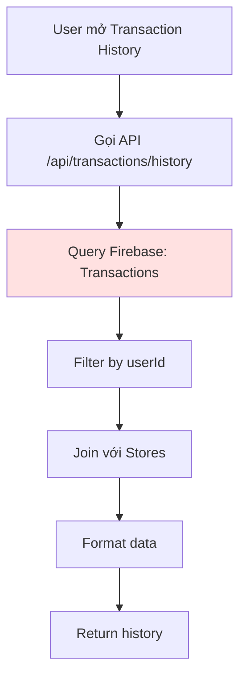

**Database Query (Firebase):**

```javascript
const transactionsQuery = query(
  collection(db, 'transactions'),
  where('userId', '==', userId),
  orderBy('borrowTime', 'desc'),
  limit(limit || 50)
);

const transactions = await getDocs(transactionsQuery);

// For each transaction, fetch store info
const enrichedTransactions = await Promise.all(
  transactions.docs.map(async (doc) => {
    const data = doc.data();
    const borrowStore = await getStore(data.borrowStoreId);
    const returnStore = data.returnStoreId 
      ? await getStore(data.returnStoreId) 
      : null;
    return {
      ...data,
      borrowStoreName: borrowStore?.name,
      returnStoreName: returnStore?.name
    };
  })
);
```

---

## Notifications System

### Luồng gửi notification

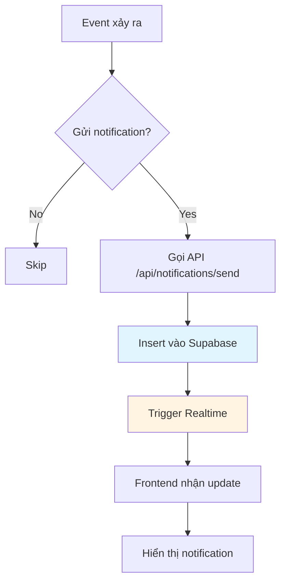

**Database Operations:**

```sql
-- Insert notification
INSERT INTO notifications (
  user_id, type, title, message, url, data
) VALUES (
  :userId, :type, :title, :message, :url, :data::jsonb
);

-- Frontend queries unread notifications
SELECT * FROM notifications
WHERE user_id = :userId AND read = false
ORDER BY timestamp DESC
LIMIT 20;
```

---

## Error Handling & Rollback

### Luồng xử lý lỗi

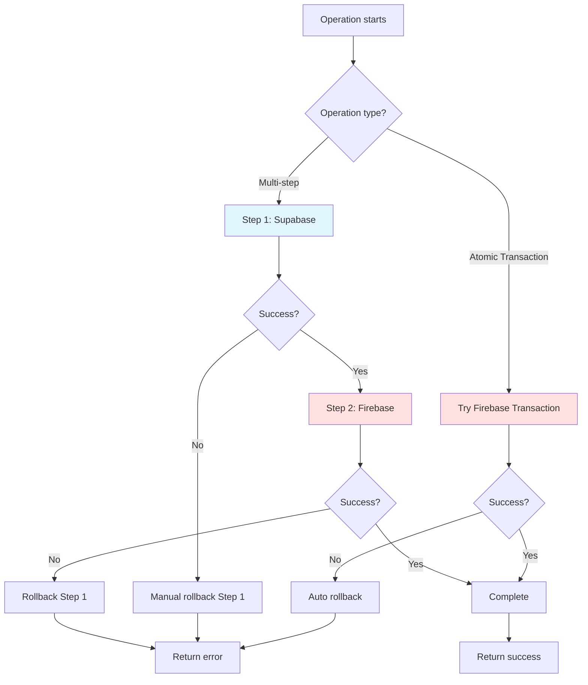

**Rollback Strategy:**

1. **Firebase Transactions:** Tự động rollback nếu fail
2. **Supabase + Firebase:** 
   - Nếu Firebase transaction fail sau khi đã update Supabase:
     - Thử refund wallet (nếu là borrow operation)
     - Log error để admin xử lý thủ công
     - Gửi notification cho user

---

## Security & Permissions

### Luồng kiểm tra quyền

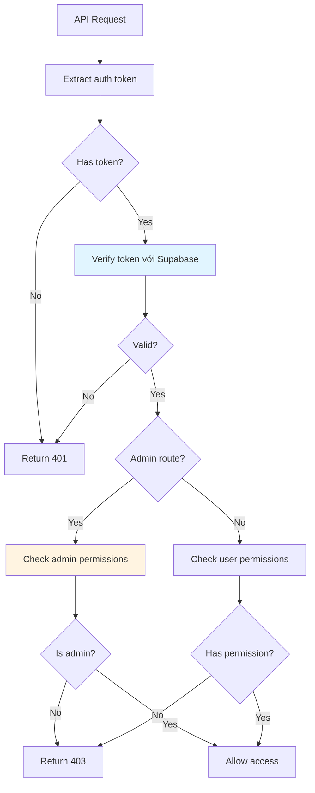

**RLS Policies (Supabase):**

- Users chỉ có thể đọc/ghi dữ liệu của chính mình
- Admins có thể đọc/ghi tất cả (qua service role bypass RLS)
- Public có thể đọc một số bảng (leaderboard, stores, cups)

---

## Realtime Updates

### Luồng Realtime

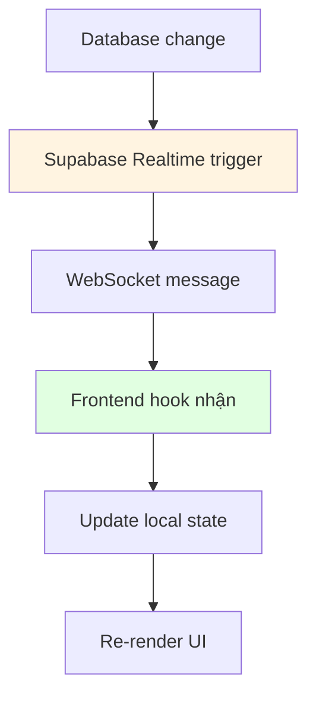

**Realtime Subscriptions:**

```typescript
// Subscribe to notifications
const { data } = supabase
  .channel('notifications')
  .on('postgres_changes', {
    event: 'INSERT',
    schema: 'public',
    table: 'notifications',
    filter: `user_id=eq.${userId}`
  }, (payload) => {
    // Update notifications list
    setNotifications(prev => [payload.new, ...prev]);
  })
  .subscribe();
```

---

## Tổng kết

Hệ thống CupSipSmart sử dụng kiến trúc hybrid:
- **Supabase (PostgreSQL)**: Users, Eco Actions, Admins, Social features
- **Firebase (Firestore)**: Cups, Transactions, Stores (real-time operations)

Các điểm quan trọng:
1. **Atomic Operations**: Firebase transactions đảm bảo consistency cho cups/transactions/stores
2. **Cross-database Operations**: Cần xử lý rollback thủ công khi kết hợp Supabase + Firebase
3. **Security**: RLS policies trong Supabase, Firebase Security Rules
4. **Realtime**: Supabase Realtime cho notifications, Firebase Realtime cho inventory updates
5. **Caching**: Leaderboard được cache trong Supabase table, update định kỳ

